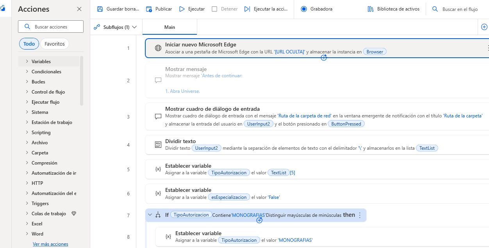
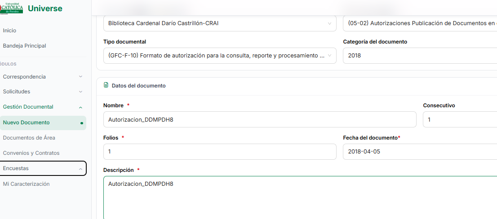
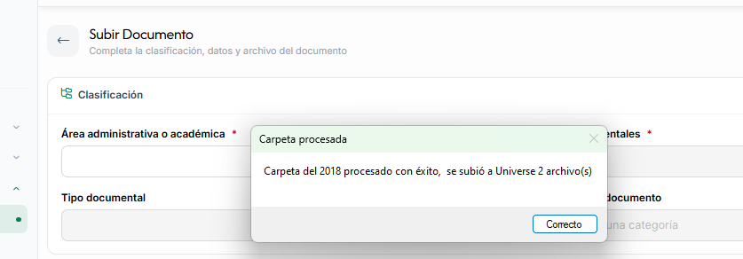

# 🤖 Automatización de carga documental con Power Automate Desktop

Robot de automatización desarrollado con **Microsoft Power Automate Desktop (PAD)** para agilizar el proceso de carga y clasificación de documentos PDF en un sistema institucional de gestión documental.

La automatización permite procesar múltiples archivos de una carpeta, identificar información asociada al programa académico y año, clasificar los documentos en el sistema, cargarlos y finalmente renombrarlos con un consecutivo de control.

## 🎯 Objetivo

Automatizar un proceso repetitivo de gestión documental que anteriormente requería realizar manualmente múltiples acciones para cada archivo.

El robot busca:

- Reducir el tiempo empleado en tareas repetitivas.
- Disminuir errores durante la clasificación y carga de documentos.
- Evitar procesar nuevamente archivos que ya fueron registrados.
- Mantener un consecutivo de los documentos procesados.
- Automatizar la interacción con el sistema de gestión documental.
- Facilitar el procesamiento de grandes cantidades de archivos PDF.

## ⚙️ Funcionamiento

El flujo recibe como entrada la **ruta de una carpeta** que contiene los documentos PDF que deben ser procesados.

A partir de esta ruta, el robot obtiene información como:

- Tipo de autorización.
- Programa académico.
- Año.
- Archivos PDF disponibles.

El flujo posteriormente identifica los archivos que aún no han sido procesados y los incorpora a una lista de archivos pendientes.

```text
Carpeta de documentos
        │
        ▼
Obtención de ruta
        │
        ▼
Identificación de parámetros
        │
        ├── Tipo de autorización
        ├── Programa académico
        └── Año
        │
        ▼
Obtención de archivos PDF
        │
        ▼
¿El archivo ya fue procesado?
        │
     ┌──┴──┐
    Sí     No
    │       │
 Ignorar    ▼
        FilesPendientes
             │
             ▼
      Clasificación documental
             │
             ▼
       Carga del documento
             │
             ▼
       Registro en el sistema
             │
             ▼
       Renombrado y consecutivo
             │
             ▼
       Siguiente documento
```

## 🔄 Proceso automatizado

### 1. Selección de carpeta

El usuario proporciona al robot la ruta de la carpeta que contiene los documentos que se desean procesar.

El flujo analiza la estructura de la ruta para obtener información necesaria para la clasificación.

### 2. Identificación del tipo de autorización

El robot identifica el tipo de autorización a partir de la ruta de origen.

Actualmente contempla categorías como:

- Monografías.
- Prácticas.

### 3. Identificación del programa académico

El flujo obtiene el código del programa desde la ruta y posteriormente realiza un mapeo hacia el nombre utilizado por el sistema documental.

Ejemplo:

```text
Código de carpeta
       ↓
      CSP
       ↓
Comunicacion
```

También se contemplan diferentes programas académicos y programas de especialización.

### 4. Identificación del año

El año correspondiente al proceso se obtiene automáticamente a partir de la estructura de carpetas.

Esto permite que el mismo flujo pueda utilizarse para diferentes años sin modificar manualmente el proceso.

### 5. Obtención de documentos

El robot obtiene los archivos con extensión `.pdf` de la carpeta seleccionada.

Los archivos se almacenan temporalmente en una lista para su posterior procesamiento.

### 6. Control de documentos procesados

Antes de iniciar la carga, el robot verifica el nombre de cada archivo.

Los documentos cuyo nombre ya contiene:

```text
Universe
```

son excluidos del procesamiento.

Los documentos pendientes se almacenan en:

```text
FilesPendientes
```

Esto evita volver a procesar documentos que ya fueron registrados.

### 7. Manejo del consecutivo

El usuario proporciona el último consecutivo utilizado en el sistema.

El robot utiliza este valor como punto de partida y genera automáticamente el siguiente consecutivo para cada documento procesado.

Ejemplo:

```text
Último consecutivo: 125

Documento 1 → 126
Documento 2 → 127
Documento 3 → 128
```

### 8. Clasificación en el sistema documental

El robot interactúa con la interfaz web del sistema institucional utilizando automatización de interfaz y navegación mediante teclado.

Completa progresivamente los campos correspondientes a la clasificación documental.

Para determinadas estructuras de clasificación se utiliza **JavaScript ejecutado desde Power Automate Desktop** para localizar elementos dentro de árboles desplegables.

### 9. Carga del documento

Una vez completada la clasificación, el robot:

1. Abre el selector de archivos.
2. Utiliza la ruta del documento actual.
3. Selecciona el archivo PDF.
4. Regresa al sistema documental.
5. Completa los campos restantes.
6. Guarda el documento.

### 10. Registro de fecha

El flujo utiliza **PowerShell** para obtener automáticamente la fecha de modificación del archivo:

```powershell
(Get-Item $ruta).LastWriteTime.ToString("yyyy-MM-dd")
```

Esta información se incorpora al proceso de registro documental.

### 11. Renombrado del archivo

Después de completar correctamente el registro, el archivo es renombrado agregando el identificador de procesamiento.

Ejemplo:

```text
Autorizacion_Ejemplo.pdf
        ↓
Autorizacion_Ejemplo_Universe(126).pdf
```

Esto permite identificar visualmente que el documento ya fue procesado y conservar el consecutivo asociado.

### 12. Procesamiento del siguiente documento

Una vez finalizado un documento, el robot regresa al formulario de creación de un nuevo documento y continúa automáticamente con el siguiente elemento de `FilesPendientes`.

El proceso continúa hasta finalizar todos los documentos pendientes.

## 🧠 Lógica de procesamiento

Una de las características importantes del robot es la separación entre la detección de archivos y su procesamiento.

```text
Files
  │
  ▼
Filtrar archivos procesados
  │
  ├── Contiene "Universe" → Ignorar
  │
  └── No contiene "Universe"
             │
             ▼
       FilesPendientes
             │
             ▼
       Procesamiento
```

Esto permite ejecutar nuevamente el robot sobre una carpeta sin volver a cargar automáticamente los documentos que ya fueron procesados.
## 📸 Capturas del proceso

### Preparación

Vista del flujo principal en Microsoft Power Automate Desktop y sus etapas iniciales.



### Procesamiento

Ejemplo de la automatización durante el diligenciamiento de los datos del documento en el sistema de gestión documental.



### Resultado

Confirmación de finalización del proceso y carga de los documentos.


## 🛠️ Tecnologías utilizadas

- **Microsoft Power Automate Desktop**
- **Web Automation**
- **UI Automation**
- **JavaScript**
- **PowerShell**
- **Microsoft Edge**
- **Sistema institucional de gestión documental**
- Automatización mediante teclado y controles de interfaz.

## 📁 Estructura propuesta del repositorio

```text
robot-autorizaciones-universe/
│
├── README.md
│
├── flow/
│   └── flujo-automatizacion.txt
│
├── screenshots/
│   ├── preparacion.png
│   ├── procesamiento.png
│   └── resultado.png
│
└── docs/
    └── arquitectura.md
```

> **Nota:** La estructura anterior corresponde a la documentación del proyecto para portafolio. El flujo original de Power Automate Desktop permanece en el entorno donde fue desarrollado.

## 🔐 Seguridad y privacidad

Este repositorio está preparado para mostrar el proyecto como parte de un portafolio profesional.

Por motivos de seguridad y privacidad **no se publican**:

- Credenciales.
- Sesiones autenticadas.
- Datos personales de estudiantes.
- Documentos institucionales reales.
- Rutas internas de red.
- Información sensible de la Universidad.
- Identificadores internos innecesarios.
- Configuraciones privadas del sistema institucional.

Las capturas y ejemplos utilizados en la documentación deben evitar información personal o institucional sensible.

## 📊 Beneficios de la automatización

La automatización permite centralizar en un único flujo tareas que anteriormente requerían intervención manual repetitiva.

Entre sus principales beneficios se encuentran:

- **Ahorro de tiempo** durante el procesamiento de múltiples documentos.
- **Reducción de errores manuales** en la clasificación.
- **Procesamiento por lotes** de documentos PDF.
- **Control de consecutivos**.
- **Identificación automática de documentos procesados**.
- **Reutilización del flujo** para diferentes programas y años.
- **Integración de diferentes tecnologías** dentro de una misma automatización.

## 💡 Aspectos técnicos destacados

El proyecto combina diferentes mecanismos de automatización:

```text
Power Automate Desktop
        │
        ├── Variables
        ├── Condicionales
        ├── Switch / Case
        ├── Bucles
        ├── Listas
        ├── File System
        ├── UI Automation
        ├── Web Automation
        ├── JavaScript
        └── PowerShell
```

Esta combinación permite automatizar tanto la manipulación de archivos en Windows como la interacción con una aplicación web.

## 📌 Estado del proyecto

**Estado:** Funcional y utilizado para automatizar el procesamiento de documentos institucionales.

El flujo ha sido desarrollado de forma incremental, incorporando mecanismos de validación, filtrado de documentos, manejo de consecutivos y automatización de diferentes etapas del proceso.

## 👨‍💻 Autor

**Luis Felipe Correa Martínez**

Proyecto desarrollado como iniciativa de automatización de procesos mediante **RPA (Robotic Process Automation)** utilizando Microsoft Power Automate Desktop.
